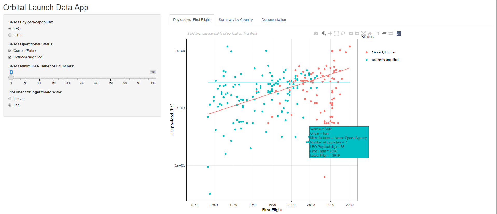
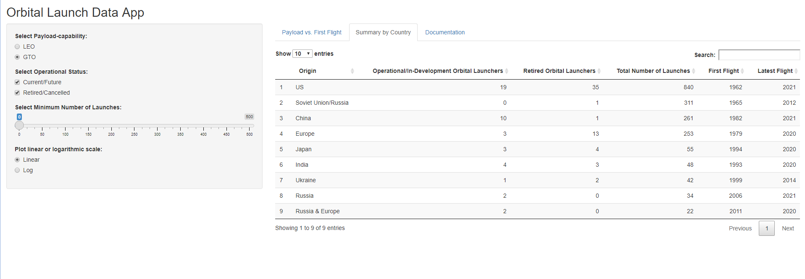

Orbital Launch Data App
========================================================
date: 01/09/21
autosize: true
transition: rotate
font-family: 'Lucida'

What is it?
========================================================

**An App that puts orbital launch vehicle data at your finger tips.**

With the Orbital Launch Data App, a user is able to:
 - Easily access/filter orbital launcher data about operational, in-development and retired vehicles
 - Visually explore trends in orbital launcher payload capability - both LEO and GTO
 
Whether you're a researcher or just a curious space nerd, data on orbital launch vehicles can often be difficult to find. 

This app provides a **free and easy-to-use database**. In one place, a user can now explore orbital launch vehicle data such as: manufacturer, country of origin, payload capacity, number of launches, first flight.

Filter Data
========================================================

Using the left-hand-side panel (see below), a user can restrict the orbital launchers shown based on **LEO/GTO capability, operational status and number of launches.**

Visualise Trends 
========================================================

**View trends in payload capacity over time**

<iframe src="pl.html" style="position:absolute;height:80%;width:80%"></iframe>

Summarise by Country
========================================================

**Summarise orbital launchers by country in tabular format**

